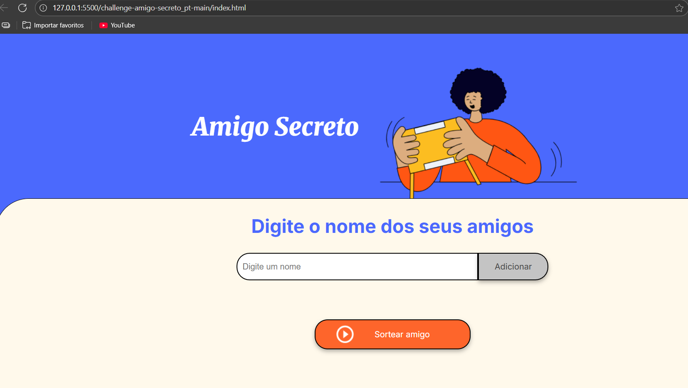
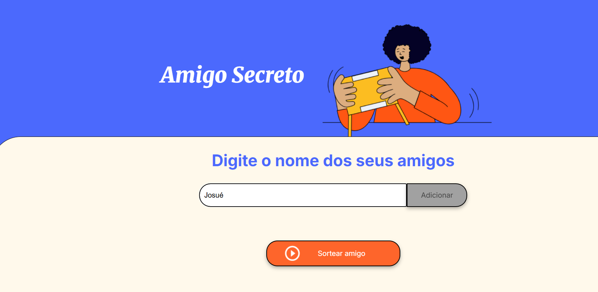
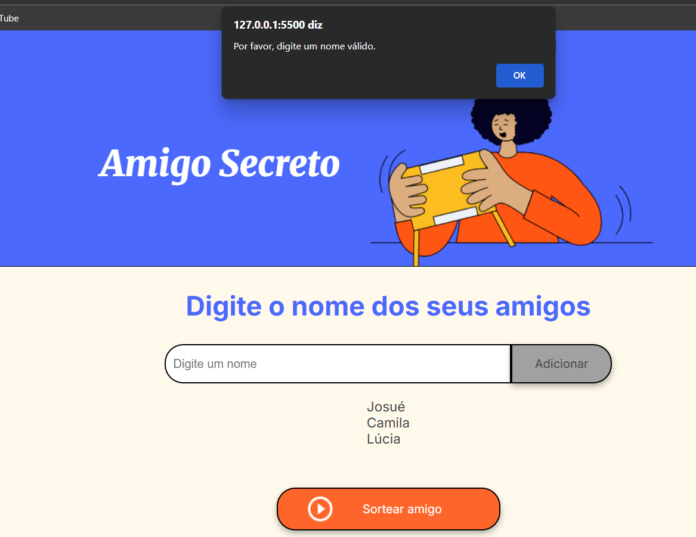
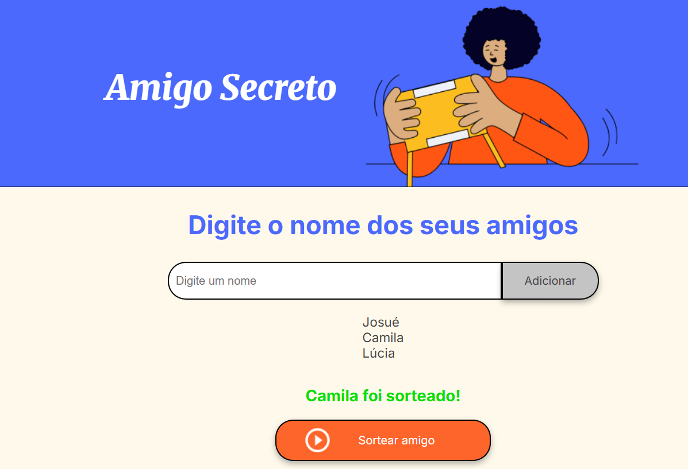

## <h1 align="center">🎁 Challenge Amigo Secreto</h1>

  

  
  
  

---

## 🧭 Índice

- [📘 Descrição do Projeto](#-descrição-do-projeto)
- [🚧 Status do Projeto](#-status-do-projeto)
- [✨ Funcionalidades e Demonstração](#-funcionalidades-e-demonstracão)
- [📁 Acesso ao Projeto](#-acesso-ao-projeto)
- [🧪 Tecnologias Utilizadas](#-tecnologias-utilizadas)
- [🤝 Pessoas Contribuidoras](#-pessoas-contribuidoras)
- [👩‍💻 Pessoas Desenvolvedoras](#-pessoas-desenvolvedoras)
- [📄 Licença](#-licença)

---

## 📘 Descrição do Projeto

Este projeto foi desenvolvido como parte de um desafio da Alura para criar uma aplicação de sorteio de amigo secreto. A proposta é permitir que os usuários cadastrem participantes e realizem o sorteio de forma simples, divertida e segura.

---

## 🚧 Status do Projeto

> 🔧 Projeto em desenvolvimento

---

## ✨ Funcionalidades e Demonstração

- 👥 Cadastro de participantes
- 🔄 Sorteio aleatório e automático
- 📱 Interface responsiva
- 🎨 Visual leve e intuitivo

    
    
Inicia o sorteio do amigo secreto, solicitando ao usuário que digite o nome dos amigos, um por vez no espaço em branco.

    
    
Assim que o primeiro nome é digitado o usu´srio deverar clicar no botão de Adicionar. Após adicionar o nome , o usuário poderá adicionar outro nome.

    
    
Na tela ficará a mostra a lista de nomes adicionados á lista.

    
    
Se nenhum nome for adicionado e o espaço ficar em branco, o jogo envia uma mensagem ao usuário para que  seja digitado um nome válido.

    
    
Quando todos os nomes desejados forém adicionado, então o usuário clica no botão Sortear amigo.Logo aparecerá o nome sorteado aleatóriamente.Para reeniciar o sorteio é só atualizar a página.

---

## 📁 Acesso ao Projeto

Você pode acessar o código-fonte [aqui](https://github.com/CharleneCosta85/challenge-amigo-secreto).

### 🛠️ Como rodar localmente

 https://github.com/CharleneCosta85/challenge-amigo-secreto.git

Depois, basta abrir o arquivo `index.html` em seu navegador.

---

## 🧪 Tecnologias Utilizadas

- HTML5
- CSS3
- JavaScript

---

## 🤝 Pessoas Contribuidoras

Ainda não há contribuições externas. Quer colaborar? Veja como abrir uma [issue](https://github.com/CharleneCosta85/challenge-amigo-secreto/issues) ou envie um pull request!

---

## 👩‍💻 Pessoas Desenvolvedoras

    
    
**Charlene Costa**

---

## 📄 Licença

📝 Este projeto está licenciado sob a **Licença MIT**.  
🔗 Veja o arquivo [LICENSE](LICENSE) para mais detalhes.

---
